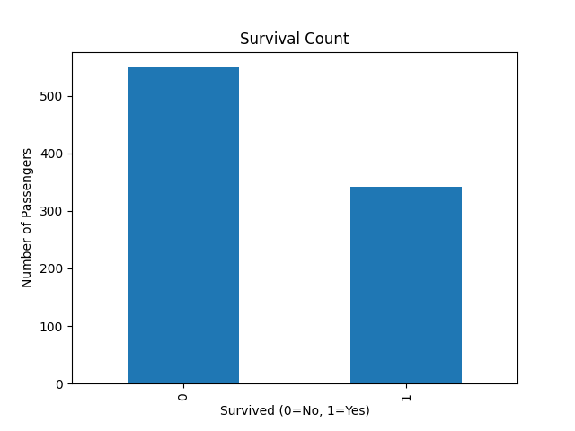
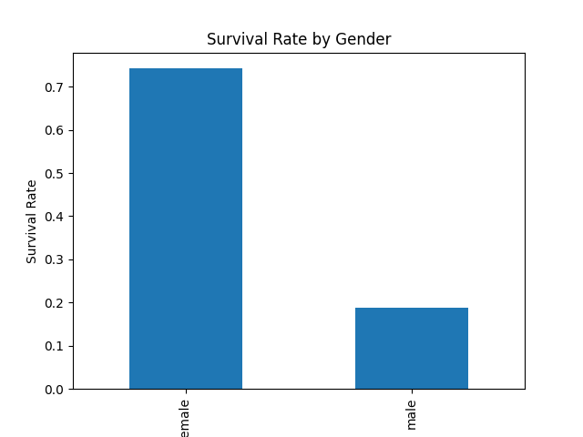
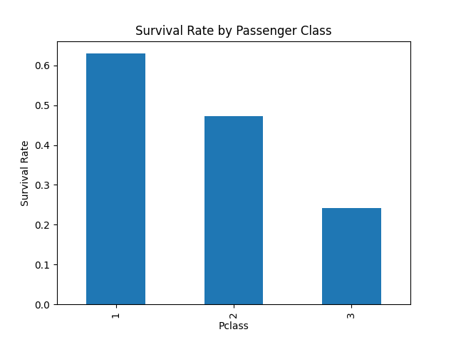

# 🚢 Titanic Exploratory Data Analysis (EDA)

## 📌 Objective

Perform Exploratory Data Analysis (EDA) on the Titanic dataset to uncover survival patterns and passenger insights.

## 🛠 Technologies Used

* Python
* Pandas
* Matplotlib
* Jupyter Notebook

## 📂 Dataset

Titanic Dataset from Kaggle.

## 🔄 Workflow

1. Data Loading
2. Data Exploration
3. Missing Value Analysis
4. Survival Analysis
5. Gender-Based Analysis
6. Passenger Class Analysis
7. Data Visualization
8. Key Insights

## 📊 Visualizations

### Survival Count

### Survival Rate by Gender

### Survival Rate by Passenger Class

## 🔍 Key Findings

* Dataset contains 891 passengers and 12 features.
* Age has 177 missing values.
* Cabin has 687 missing values.
* Females had a significantly higher survival rate than males.
* First-class passengers had better survival chances than second and third-class passengers.
* Average passenger age was approximately 29.7 years.

## 👨‍💻 Author

Devesh Vishwakarma
